# SKOL System Architecture

<!-- Render: cd IST782 && make -->

## Color Legend

| Color | Course | Contribution |
|-------|--------|-------------|
| Gray (#BBBBBB) | External | Journal web sites (not my work) |
| Blue (#4477AA) | IST 718 Big Data Analytics | PySpark classifier pipeline |
| Cyan (#66CCEE) | IST 664 NLP | Taxon class, SBERT embeddings, MycoSearch |
| Gold (#CCBB44) | IST 691 Deep Learning | Mistral JSON feature extraction |
| Coral (#EE6677) | IST 769 Adv. Database Mgmt | CouchDB, Redis, Neo4j, pipeline orchestration |
| Purple (#AA3377) | IST 690 Independent Study | Ingesters, web app, constrained decoding, deployment |

Palette: Paul Tol "bright" qualitative scheme (colorblind-safe, print/projection robust).

## Architecture Diagram

```mermaid
flowchart LR
    %% ── Paul Tol bright qualitative palette ─────────────────
    classDef external fill:#BBBBBB,stroke:#888888,color:#000000
    classDef ist718  fill:#4477AA,stroke:#2E5C8A,color:#FFFFFF
    classDef ist664  fill:#66CCEE,stroke:#3DA8CC,color:#000000
    classDef ist691  fill:#CCBB44,stroke:#A89930,color:#000000
    classDef ist769  fill:#EE6677,stroke:#CC4455,color:#000000
    classDef ist690  fill:#AA3377,stroke:#882255,color:#FFFFFF

    %% The approach: fills are blended ~50% toward white, strokes are
    %% blended ~30% toward white, and all text is #999999 to complete
    %% the washed-out effect.
    %% ── Washed-out Paul Tol bright palette (greyed-out elements) ──
    classDef external_grey fill:#DDDDDD,stroke:#BBBBBB,color:#999999
    classDef ist718_grey  fill:#A1B8D4,stroke:#7A9ABF,color:#999999
    classDef ist664_grey  fill:#B3E6F7,stroke:#8CCCE0,color:#999999
    classDef ist691_grey  fill:#E6DDA1,stroke:#C4BA80,color:#999999
    classDef ist769_grey  fill:#F7B3BB,stroke:#D4939A,color:#999999
    classDef ist690_grey  fill:#D499BB,stroke:#B37A9E,color:#999999

    %% ── Legend ──────────────────────────────────────────────────
    subgraph Legend[" "]
        direction LR
        Lext["External"]:::external_grey ~~~
        L718["Classification"]:::ist718_grey ~~~
        L664["Embedding"]:::ist664_grey ~~~
        L691["Description to JSON"]:::ist691_grey ~~~
        L769["Data Storage"]:::ist769 ~~~
        L690["UI & Web site"]:::ist690_grey
    end

    %% ── Data Sources ────────────────────────────────────────
    JOURNALS["Journal Web Sites<br/>(Mycotaxon, Persoonia, MycoKeys,<br/>IMA Fungus, Studies in Mycology,<br/>J. of Fungi, MycoWeb, Internet Archive)"]:::external_grey

    %% ── Ingestion ───────────────────────────────────────────
    INGEST["Ingesters<br/>(RSS, Ingenta, Pensoft, MDPI,<br/>Internet Archive, CrossRef)"]:::ist690

    %% ── Document Storage ────────────────────────────────────
    COUCH_ART[("CouchDB<br/>Articles, PDFs, Metadata")]:::ist769

    %% ── Text Extraction ─────────────────────────────────────
    PDF["PDF Text Extraction<br/>(PyMuPDF + OCR fallback)"]:::ist769

    %% ── Classification ──────────────────────────────────────
    CLASS["PySpark Classifier<br/>(Logistic Regression, TF-IDF)<br/>Nomenclature | Description | Misc"]:::ist718_grey

    %% ── Taxon Construction ──────────────────────────────────
    TAXON["Build Taxons<br/>(Nomenclature + Description)"]:::ist664_grey

    %% ── Flow ────────────────────────────────────────────────
    subgraph Flow[" "]
        direction LR
        JOURNALS --> INGEST
    	INGEST --> COUCH_ART
	COUCH_ART --> PDF
    	PDF --> CLASS
    	CLASS --> TAXON
    end
```

