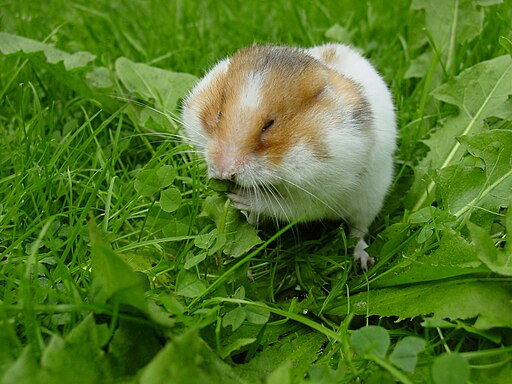
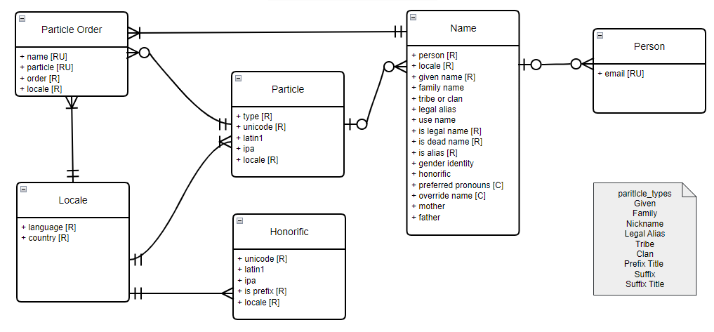
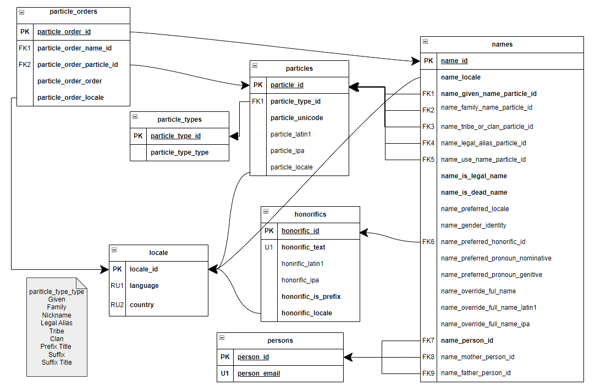
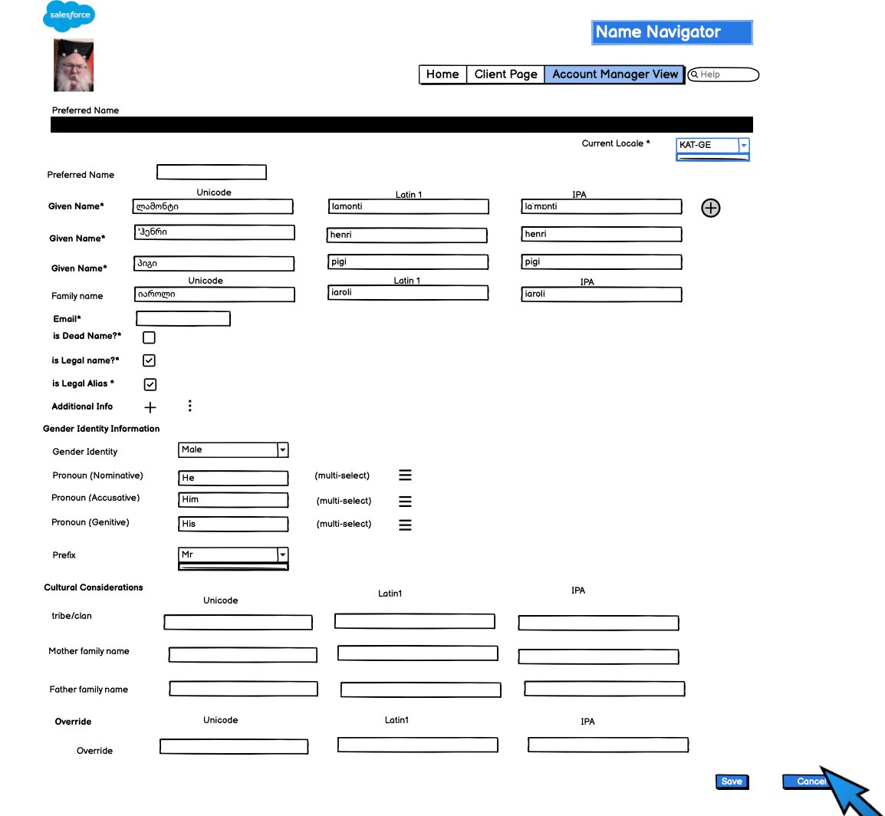
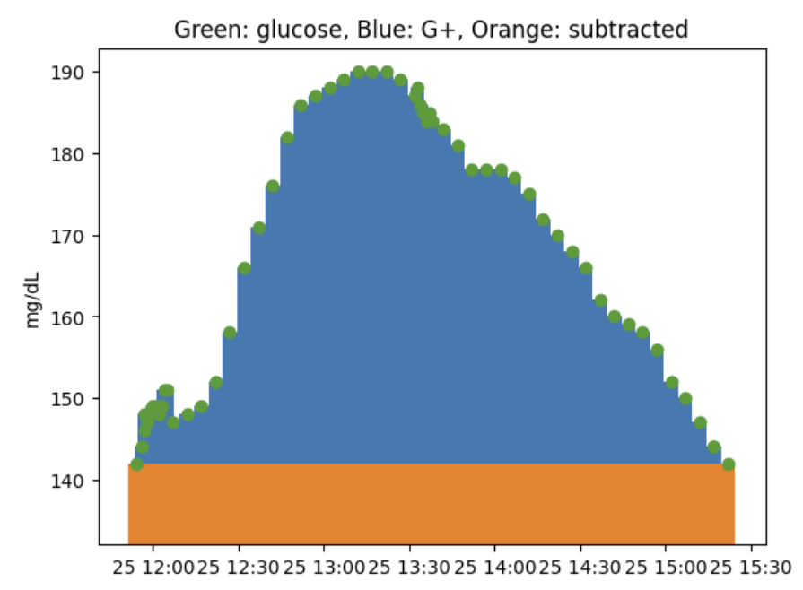
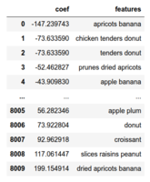
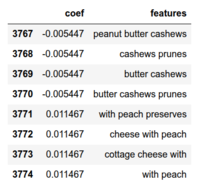
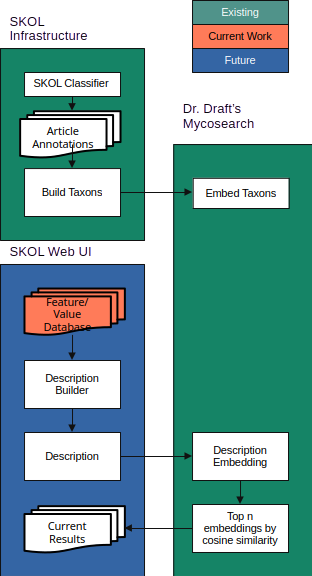
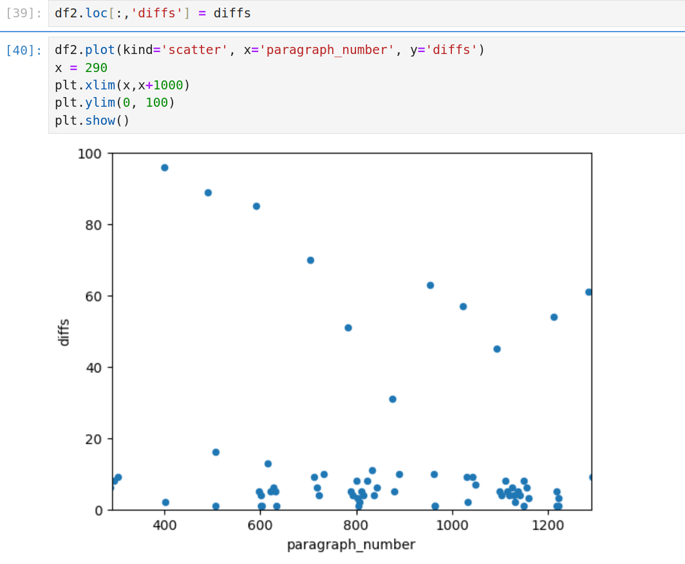
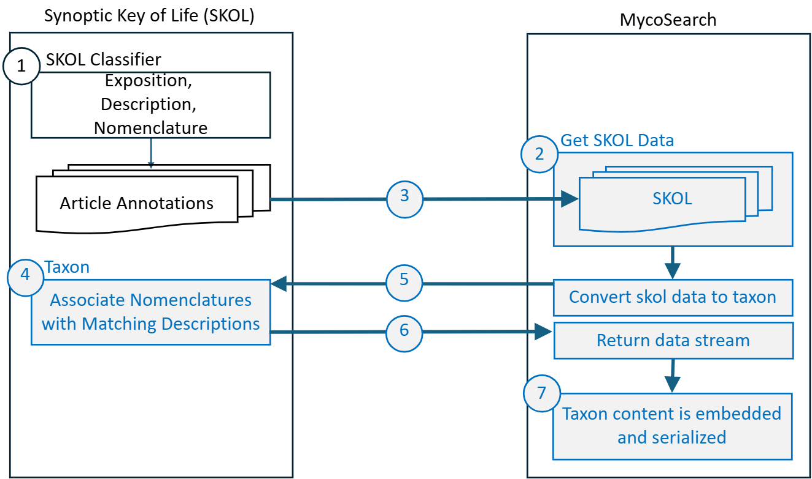

# M.S. in Applied Data Science Portfolio

## La Monte Henry Piggy Yarroll, [orcid.org/0009-0006-3073-6352](https://orcid.org/0009-0006-3073-6352)

Syracuse University School of Information Studies

March 2026

---


*Peter Maas, CC BY-SA 2.5 <https://creativecommons.org/licenses/by-sa/2.5>, via Wikimedia Commons*

# The Data Hamster

I am a data hamster. I hoard data whenever I can. I have a complete
record of almost every meal for the last several years. I have email
archives going back to 1989. I've scanned hundreds of public domain
books for Project Gutenberg. I have a large collection of open access
and public domain mycological literature.

Information is data imbued with meaning. Information in a useful form
is knowledge. I document here my effort to convert much of my data to
knowledge.  The Syracuse University iSchool Masters in Applied Data
Science gave me the opportunity to explore much of my lifetime data
hoard.

The recent explosion in Large Language Models enabled several parts of
my Synoptic Key of Life Project (SKOL). I started this project in 2019
to understand the scattered mycological literature through machine
learning, with little concept of how to implement the full stack, but
with confidence that the technology would soon be available.

I developed a deeper understanding of traditional machine learning
methods which allowed me to create actionable insights from my food
and blood glucose records. I invented a metric which captures the
glycemic impact of the meals that I personally eat, without having to
rely on fasting measurements or careful weighing of foods.

Almost everyone has experienced some mangling of their name. I was
able to recruit a group of fellow students to explore the problem of
really recording names in a way that is personally and culturaly
aware. We implemented these ideas in a SQL database as a component of
a Customer Relationship Manager.

I enrolled in the MS in Applied Data Science program specifically to
acquire the skills to turn my data into knowledge.

## Program Learning Goals

This portfolio demonstrates achievement of the six program learning
goals through five course projects spanning database design, text
mining, deep learning, natural language processing, and big data
management. The table below summarizes the goals; subsequent sections
show how each project addresses them.

| # | Learning Goal | Shorthand |
|---|--------------|-----------|
| **G1** | Collect, store, and access data by identifying and leveraging applicable technologies | *Data technologies* |
| **G2** | Create actionable insight across a range of contexts (e.g. societal, business, political), using data and the full data science life cycle | *Actionable insight* |
| **G3** | Apply visualization and predictive models to help generate actionable insight | *Visualization & models* |
| **G4** | Use programming languages such as R and Python to support the generation of actionable insight | *Programming* |
| **G5** | Communicate insights gained via visualization and analytics to a broad range of audiences (including project sponsors and technical team leads) | *Communication* |
| **G6** | Apply ethics in the development, use and evaluation of data and predictive models (e.g., fairness, bias, transparency, privacy) | *Ethics* |

---

## Name Navigator (IST 659: Data Administration Concepts and Database Management)

*"Name Navigator" Database Application, Spring 2024. Team:
 La&nbsp;Monte&nbsp;Henry&nbsp;Piggy&nbsp;Yarroll,
 Oluwaseyi&nbsp;Durosinmi-Etti, Peter&nbsp;Le,
 Christopher&nbsp;Murphy.*

### Project Summary

The Name Navigator is a database application that represents human
personal names in a culturally aware way, suitable for use in a
Customer Relationship Management (CRM) system. Naming conventions vary
world-wide; assumptions based on Western English-speaking culture
often result in insensitive mangling of names. The system provides
locale-specific views of names for different applications: formal
address, informal conversation, legal documents, and pronunciation
guidance.

The database supports multiple locales (English/US and
Georgian/Georgia in the initial implementation), Unicode and IPA
pronunciation for each name particle, gender identity and pronoun
preferences, the concept of "dead names" (names no longer used by an
individual), and an override mechanism for contacts who prefer not to
provide detailed name components.

### Learning Goals Addressed

We built this project built upon an ethical observation: people's
names really matter (G6 *Ethics*). I recruited a team that shared my
vision and we implemented a solid CRM component (G2 *Actionable
Insight*), in SQL and T-SQL (G4 *programming languages).

The system supports dead names (old names that should no longer be
used such "maiden names"), collects gender identity and preferred
pronouns, and provides an override mechanism in case we failed to
account for a particular naming convention (G6 *Ethics*).

The project centered around collecting, storing and accessing (G1)
name information.

We practiced communicating data relationships via standard modeling
diagrams (G5 *Communication*) and mockups (with Balsamiq).


*Conceptual Model for Name Navigator*


*Logical Model for Name Navigator*


*Balsamiq Mockup for Name Navigator*

---

## Glycemic Increment (IST 736: Text Mining)

*"Glycemic Increment: Individualized Medicine for Diabetics," Fall 2025. Team: J.J.&nbsp;Balasi, La&nbsp;Monte&nbsp;Henry&nbsp;Piggy&nbsp;Yarroll.*

### Project Summary

This project introduced Glycemic Increment (G+), a novel metric for
estimating the blood sugar consequences of specific foods and
composite meals. Unlike population-level metrics based on fasting
conditions, such as Glycemic Index and Glycemic Load, G+ uses an
individual patient's own Continuous Glucose Monitor (CGM) data paired
with their meal logs to build a personalized linear regression
model. The coefficient for each food directly approximates that food's
effect on the patient's blood sugar based on the portions they
actually eat.

The dataset comprises two years of CGM readings (every 5 minutes) and
free-form food logs. We evaluated nine models across three meal types
(regular, extended, unpreceded), two vectorizers (Binary
CountVectorizer, QuantifierVectorizer), and two tokenizers (ngrams,
full-format parser).

### Learning Goals Addressed

This project is an example of Individualized Medicine (G2 *Actionable
Insight*) that leverages combined glycemic data and food logs.

An important part of Data Science is the process of data cleaning (G1
*collect*). The Glycemic Increment project involved convertiing
loosely structured food logs (csv format) into structured records that
we could feed into machine learning models. We applied several
different methods to extract the metric in mg*hours/dl.

We created several custom tozenizers and vectorizers in Python (G4
*Programming*). The QuantifierVectorizer is a novel contribution that
preserves quantity information from the food logs.

Here is the whole project in 3 charts (G3 *Visualization & models*)
(G5 *Communication*):


*Glycemic Increment Illustrated*



*Trigrams with G+, max and min*

The final project is formatted as an IEEE-format TeX document,
suitable for many professional journals (G5 *Communication*).

Our key insight: "While not perfect, these models are useful for
predicting the effects of specific meals on blood sugar." The food
coefficients validated expectations—konjac noodles (GI=0) showed
minimal effect; foods always eaten with rice showed confounded high
values.

---

## Feature Extraction for Fungal Taxonomy (IST 691: Deep Learning)

*"Synoptic Key of Life: Feature Extraction for Fungal Taxonomy,"
 Spring 2025. Team: La&nbsp;Monte&nbsp;Henry&nbsp;Piggy&nbsp;Yarroll,
 Padmaja&nbsp;Kurumaddali, Peter&nbsp;Le.*

### Project Summary

This project applies large and small language models to extract
structured feature information from unstructured mycological species
descriptions. The goal is to transform prose descriptions like
"Mycelium on the substrate is medium orange-brown, septate, 3–4 μm
diam." into nested JSON structures with features, subfeatures, and
values—data suitable for building synoptic key menus.

```json
{
  'mycelium': {
    'color': 'medium orange-brown',
    'septation': 'septate',
    'diameter': '3–4 μm',
  }
}
```

The work builds on the SKOL project's existing classification pipeline
and annotation corpus. The team evaluated ChatGPT 4.0, Llama 3.3 70B,
Gemma3 (27B and 12B), and Mistral 7B, ultimately fine-tuning Mistral
7B Instruct using 16 hand-built training examples. Results were
evaluated using Jaccard distance between generated and ground-truth
feature/value sets.

### Learning Goals Addressed

We used labeled OCR (G1 *Data Technologies*) page scans from three
mycological journals (Mycologia, Mycotaxon, Persoonia) labeled with
the PySpark classification pipeline built in IST 718. We used Hugging
Face transformers for fine-tuining and ollama for local model serving
(G4 *Programming* in Python). The fine-tuning dataset proved too small
to be genuinely useful, but we learned the technique well enough to
apply it (G3 *Predictive Models*).

The extracted JSON from this project was eventually (IST 690 Spring
2026) used to build menus for suggesting features for a collection,
(G2 *Actionable Insight*).

The final paper is an IEEE-format conference paper with abstract,
structured sections, figures, and references (G5
*Communication*). I presented this work at MASMC 2025 (Mid Atlantic Mycology
Conference) as a poster for a non-technical mycology audience.


*SKOL System diagram*

---

## Mycology Literature Search (IST 664: Natural Language Processing)

*"Mycology Literature Search," Fall 2024. Team: La&nbsp;Monte&nbsp;Yarroll, J.J.&nbsp;Balasi, Christopher&nbsp;Murphy, Shintaro&nbsp;Osuga.*

### Project Summary

This project created a semantic search system for mycological journal
articles using sentence transformer text embedding. The team extended
two pre-existing applications: SKOL (Synoptic Key of Life), which
classifies and annotates article content, and MycoSearch (forked from
Dr. Draft's SOTA Literature Search), which embeds and searches the
processed content.

Users input specimen descriptions (e.g., "pileus campanulate, lamellae
yellow rust-brown") and receive ranked matches from the literature
based on semantic similarity—not keyword matching.

The key contribution is the Taxon class—a custom data structure that
encapsulates nomenclature, descriptions, and metadata for each
species. Taxon objects are embedded via SBERT (all-mpnet-base-v2) into
a 768-dimensional vector space, enabling cosine similarity search
where a user's specimen description is matched against the embedded
literature.

### Learning Goals Addressed

The SBERT embeddings (G1 *Data Technologies*) produced by Dr. Draft's
MycoSearch are the core capability of https://synopitickeyof.life/skol
(G2 *Actionable Insight*).  This enables researchers and amateurs to
find relevant species descriptions without knowing exact taxonomic
terminology.

In order to figure out how to associate Nomenclature blocks with
Description blocks, we looked at plots which looked at the distances
in paragraphs between Nomenclature blocks and adjacent Description
blocks (G3 *Visualization*).


*The upper dots represent the distances between species descriptions
 within an article, indicating how far the search progresses between
 potential matches. The lower dots highlight species descriptions
 closely associated with species names. Larger distances between
 descriptions suggest a lower likelihood of relevance to the search
 criteria. Typically, the search extends up to 5–6 paragraphs before
 stopping, with increasing distances between descriptions signaling
 diminishing relevance to the query.*

Technologies used for this project include sentence transformers
(SBERT), scikit-learn, pandas, and matplotlib (G4 *Programming*).


*The flow diagram above depicts the process of transferring the annotated mycology descriptions from SKOL to MycoSearch, converting them to Taxon format, and embedding the content into MycoSearch. The light blue items (2-7) are new or modified code.*

---

## SKOL IV: All the Data (IST 769: Advanced Database Management)

*"SKOL IV: All the Data," Fall 2025. Solo project: La&nbsp;Monte&nbsp;Henry&nbsp;Piggy&nbsp;Yarroll.*

### Project Summary

This project implements the complete SKOL data pipeline from ingestion
through search, bringing together all previous course work into a
near-production system. The Jupyter notebook orchestrates web scraping
(with robots.txt compliance), PDF text extraction and OCR, text
classification, Taxon object construction, SBERT embedding, LLM-based
JSON feature extraction, and hierarchical clustering—all backed by
CouchDB for document storage, Redis for caching models and embeddings,
PySpark for distributed processing, and Neo4j for graph-based
exploration of taxonomic clusters.

The system ingests articles from multiple sources (Mycotaxon and
Studies in Mycology via Ingenta Connect RSS feeds, historical works
from MycoWeb archives), and processes them through the full pipeline.

Agglomerative hierarchical clustering produces "pseudoclades",
grouping taxa with similar descriptions, revealing biological
relationships inferred purely from textual similarity.

### Learning Goals Addressed

This project is an intermediate state between the technology
components defiend in earlier classes and the production web site
produced in IST 690. This is where I chose the production data storage
technologies for SKOL (G1 *Data Technologies*):

* CouchDB: Document store for taxa records, article metadata, PDF
  attachments, and JSON structures. CouchDB's native JSON support is
  ideal for the nested feature structures.
* Redis: In-memory cache for SBERT embeddings and trained classifier
  models, with configurable expiration.
* PySpark: Distributed processing for classification and text extraction at scale.
* Neo4j: Graph database for hierarchical clustering of taxa based on embedding similarity.
* Web scraping with robots.txt compliance (urllib.robotparser).
* RSS feed ingestion (feedparser) for ongoing article collection.
* PDF text extraction (PyMuPDF/fitz) with OCR fallback.
* Bibtex parsing for citation metadata.
* Parquet files for intermediate data.

In addition to the classification, embedding, and SLM models developed
in earlier classes, I built a graph database with Agglomerative
Clustering for taxonomic grouping, visualized as dendrograms in Neo4j
(G3 *models*).

I used an assortment of additional Python infrastucture: PyMuPDF (PDF
extraction), feedparser (RSS), bibtexparser (G4 *programming*).

In IST 769 we were asked to present our work as a Jupyter notebook (G5
*Communication*), as this is one of the work products that
professional Data Scientists deliver. The Jupyter notebook is a
concrete piece of reproducible research.

Given the focus of IST 769 on no-SQL databases and the large amount of
code I produced with Claude Code, I structured the notebook to hide
the non-storage components and show only the interactions with no-SQL
databases. One critical skill is to present the information that your
audience seeks and a minium of adiaphora.

**G6 — Ethics:**

<!-- robots.txt compliance: "We want to be a well-behaved web scraper. Respect robots.txt." The notebook explicitly checks robots.txt before scraping each source. Open access: Only ingests open-access or public-domain literature. GPLv3 license for all source code. Provenance tracking: Metadata records the source, date, and method of acquisition for every document. Appendix on AI coder usage: Transparent disclosure of Claude Code's role in the development process. -->

## Synoptic Key of Life Website (IST 690 Independent Study)

*"Building the Synoptic Key of Life website," Spring 2026. Solo project: La&nbsp;Monte&nbsp;Henry&nbsp;Piggy&nbsp;Yarroll under Dr.&nbsp;Gregory&nbsp;Block*

The independent study brought together all the pieces of the Synoptic
Key of Life and deployed the https://synoptickeyof.life/skol web site.

Detailed work items completed for IST 690 can be found at
[The SKOL Trello](https://trello.com/b/jUkRE6zv/skol).

### Project Hightlights

I used Claude Code to extract functionality from the various ipython
notebooks into standalone programs that could be run from cron jobs
(G2 *Actionable insight*).

The programs have a unified CLI with a set of standard arguments such
as `--ignore-existing`, `--dry-run`, `--verbosity=n`, etc.

With Claude Code, I built a Django/React & REST web site the provides
all the data products as usable interfaces.

I improved the translation of taxa descriptions to JSON by introducing
constrained decoding with a suitable schema, and vocabulary
normalization based on semantic similarity (G1 *Data technologies*). I
explored the use of automated ontologies (, but found that the existing
ontologies are too sparse for this application.

I tackled all the things that most application web sites need:
accounts (lots of OAuth), domain email configuration (these days a lot
more than an MX record), CI/CD automatic deployment, backups, daily reports,
static credentials, encryption, etc...

### Learning Goals Addressed

This brings the full data science lifecycle to completion:
* Problem Definition: Enable semantic search over taxonomic literature
* Data Collection: Web scraping, RSS feeds, OCR
* Data Preparation: Classification, Taxon construction
* Modeling: SBERT embeddings, LLM feature extraction, clustering
* Evaluation: Classifier accuracy, search result quality
* Deployment: synoptickeyof.life
* Monitoring: Logging and ongoing ingestion of new publications.

The article ingesters are well-behaved web scrapers. They respect
`robots.txt`, and HTTP flow control control packets such as 429
errors. They are rate-limited by default and back off if a web site
generates 403 permission errors (G6 *Ethics*).

---

## 7. Synthesis and Reflection

### Range of Contexts

I've created actionabile insights (G2) across a range of contexts:
* Business: IST 659 Name Navigator for CRM cultural awareness
* Individualized medicine: IST 736 Glycemic Increment for diabetic nutrition
* Mycology/scientific research: (IST 718), IST 691, IST 664, IST 769, IST 690 — the SKOL project

### Transparency and Reproducibility

It is essential that scientific endeavors be transparent and
reproducible (G6 *ethics*). All of the code for these projects is
available via my GitHub page: https://github.com/piggyatbaqaqi/ under
permissive licenses.

The data all have careful provenance tracking and are limited to open
access, and public domain works.

All of my papers include bibliographies citing the works I built
upon. I've carefully documented the use of Claude Code for IST 769 and
IST 690, a choice that might be controversial.

### Integrated Learning Through SKOL

IST 718 → IST 664 → IST 691 → IST 769 → IST 690 form a progression: NLP foundations, deep learning for feature extraction, and production data architecture. Each course contributed essential components to the deployed system at https://synoptickeyof.life.

### Strengths and Challenges

I feel that I have developed the skills I originally imagined I'd need
to to bring SKOL to life. I learned about and practiced Natural
Language Processing, Machine Learning models, and Large Language
Models, along with an assortment of modern Python systems, such as
CouchDB, Redis, PySpark, Django, and React.

I have leveraged my domain expertise in mycology.

I have turned much of my personal data collection into useful knowledge.

While we were able to go through the motions of LLM fine-tuning, we
were not able to get the benefits.

Scaling to the full corpus of open access & public domain mycological
literature continues to be a challenge. E.g. I've found that the
production hardware can not calculate a new SBERT embedding and
respond to search queries at the same time.

There are data quality issues with the current system. The training
suite covers a narrow range of years. It does not generalize well to
older and newer literature. The classifier is only of limited use for
languages-other-than-English (LOTE). I need to produce more manual and
semi-manual training sets.

I have found that the current system does successfully return matching
descriptions in LOTE, but these are of limited use to users who do not
read these languages. There are a number of open source translation
models available.

### Lifelong Learning Plan

I plan to continue work on SKOL and hope to recruit more participants
into the project, both developers and users.

I am actively seeking a day job in which I can use these Data Science
skills on a daily basis.

---

## 8. References

### Course Deliverables

Yarroll, L.H.P., Durosinmi-Etti, O., Le, P., & Murphy, C. (2024). Name Navigator Database Application. Syracuse University. IST 659 Final Project.

Balasi, J. & Yarroll, L.H.P. (2025). Glycemic Increment: Individualized Medicine for Diabetics. Syracuse University. IST 736 Final Project. https://github.com/piggyatbaqaqi/sugarbowl

Yarroll, L.H.P., Kurumaddali, P., & Le, P. (2025). Synoptic Key of Life: Feature Extraction for Fungal Taxonomy. Syracuse University. IST 691 Final Project.

Yarroll, L.H.P., Balasi, J., Murphy, C., & Osuga, S. (2024). Mycology Literature Search. Syracuse University. IST 664 Final Project. https://github.com/piggyatbaqaqi/skol/blob/main/IST664/IST664_Team3_Balasi_Murphy_Osuga_Yarroll.pdf

Yarroll, L.H.P. (2025). SKOL IV: All the Data. Syracuse University. IST 769 Final Project.

### Foundational Works

<!-- Add references to key conceptual works that shaped learning: SBERT, Mistral, CouchDB, etc. -->

### Data Sources

<!-- Mycologia, Mycotaxon, Persoonia, MykoWeb, etc. -->

---

## 9. Appendices

### Folder Structure

```
Portfolio/
├── 01_Overview/
│   ├── overview.pdf
│   └── resume.pdf
│
├── 02_IST659_Database_Management/
│   ├── README.txt
│   └── Naming_report.pdf
│
├── 03_IST736_Text_Mining/
│   ├── README.txt
│   ├── IST736_Balasi_Yarroll_Final_Project.pdf
│   └── glycemic_increment.ipynb
│
├── 04_IST691_Deep_Learning/
│   ├── README.txt
│   ├── IST691_final_project_paper.pdf
│   └── mistral_transfer_learning.ipynb
│
├── 05_IST664_NLP/
│   ├── README.txt
│   ├── IST664_Team3_Balasi_Murphy_Osuga_Yarroll.pdf
│   └── SKOL_presentation3.pptx
│
├── 06_IST769_Data_Management/
│   ├── README.txt
│   └── ist769_skol.ipynb
│
└── 07_Video_Presentation/
    └── portfolio_presentation.mp4
```

---

*Portfolio prepared for IST 782 — Applied Data Science Portfolio*
*Syracuse University School of Information Studies*
*Spring 2026*
